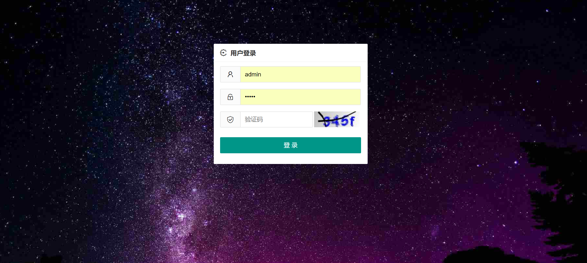
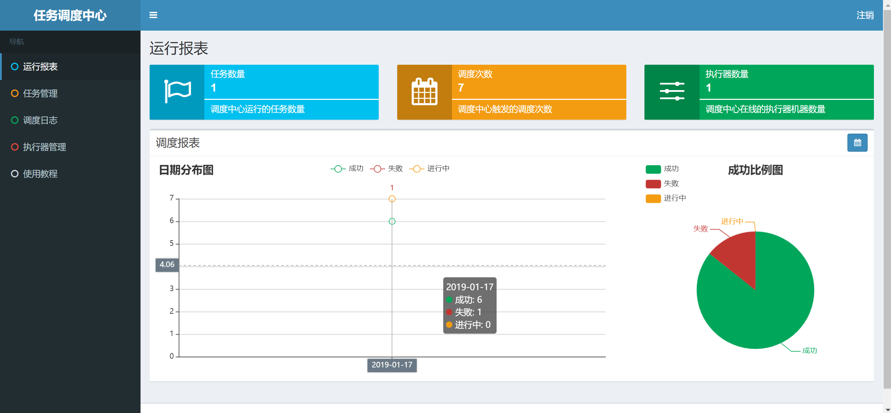
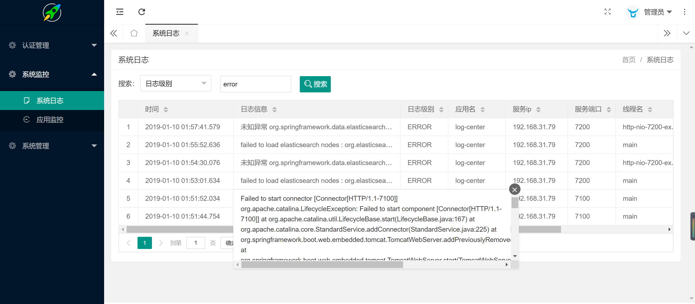
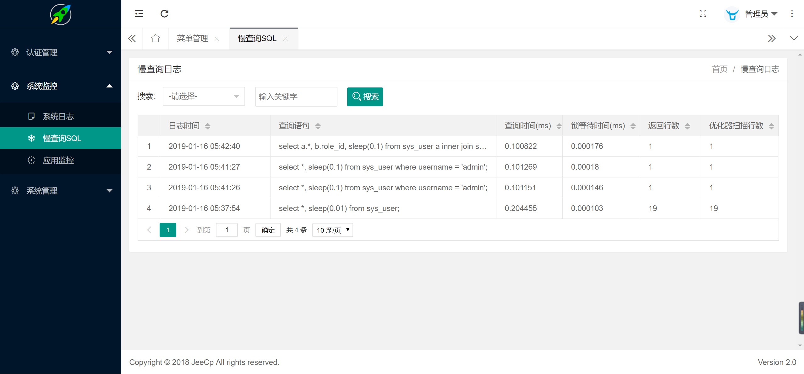
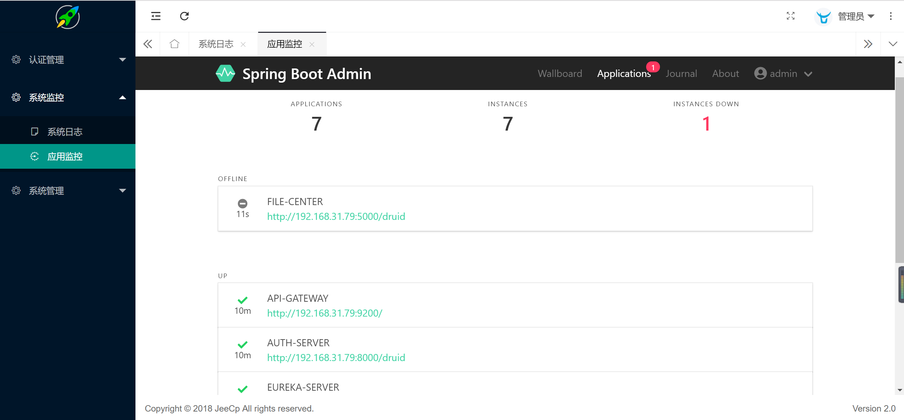
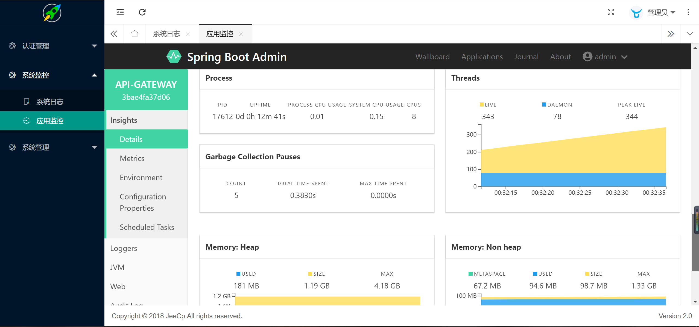
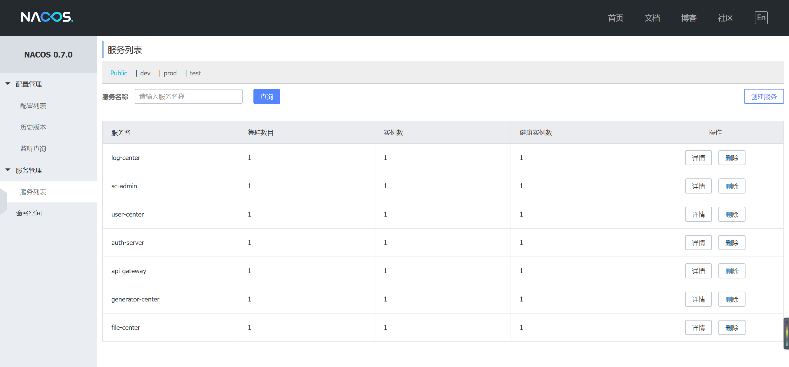
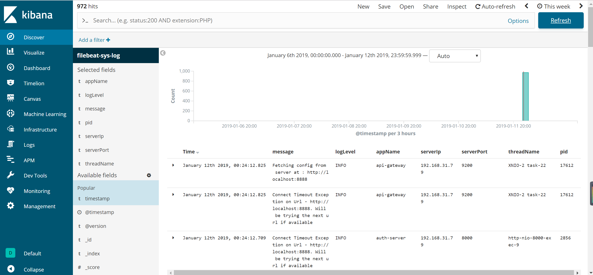
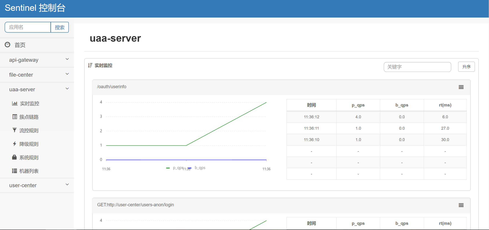

# microservices-platform

[](https://www.apache.org/licenses/LICENSE-2.0.html)

## 如果您觉得有帮助，请点右上角 "Star" 支持一下谢谢

[TOC]

## 1. 项目介绍

* **技术交流群** [250883130](http://shang.qq.com/wpa/qunwpa?idkey=17544199255998bda0d938fb72b08d076c40c52c9904520b76eb5eb0585da71e) 
* **详细在线文档** [点击查看](https://www.kancloud.cn/zlt2000/microservices-platform/919413)
* 演示地址
  * url： [http://120.78.94.191:8066](http://120.78.94.191:8066)
  * 账号密码：admin/admin
  * 应用监控账号密码：admin/admin
* 前后端分离的企业级微服务架构
* 基于`Spring Boot 2.0.X`、`Spring Cloud Finchley`和`Spring Cloud Alibaba`
* 深度定制`Spring Security`真正实现了基于`RBAC`、`jwt`和`oauth2`的无状态统一权限认证的解决方案
* 提供应用管理，方便第三方系统接入
* 引入组件化的思想实现高内聚低耦合，项目代码简洁注释丰富上手容易
* 注重代码规范，严格控制包依赖，每个工程基本都是最小依赖
* 非常适合学习和企业中使用

## 2. 功能介绍

* **统一认证功能**
  * 支持oauth2的四种模式登录
  * 支持用户名、密码加图形验证码登录
  * 支持手机号加密码登录
  * 支持openId登录
  * 支持第三方系统单点登录

* **分布式系统基础支撑**
  * 服务注册发现、路由与负载均衡
  * 服务降级与熔断
  * 服务限流(url/方法级别)
  * 统一配置中心
  * 统一日志中心
  * 统一分布式缓存操作类、cacheManager配置扩展
  * 分布式锁
  * 分布式任务调度器
* **系统监控功能**
  * 服务调用链监控
  * 应用监控(应用健康、JVM、内存、线程)
  * 错误日志查询
  * 慢查询SQL监控
  * 应用吞吐量监控(qps、rt)
  * 服务降级、熔断监控
  * 服务限流监控
* **业务基础功能支撑**
  * 高性能方法级幂等性支持
  * RBAC权限管理，实现细粒度控制(方法、url级别)
  * 快速实现导入、导出功能
  * 数据库访问层自动实现crud操作
  * 代码生成器
  * 基于Hutool的各种便利开发工具
  * 网关聚合所有服务的Swagger接口文档
  * 统一跨域处理
  * 统一异常处理

## 3. 模块说明

```lua
central-platform -- 父项目，公共依赖
│  ├─zlt-business -- 业务模块一级工程
│  │  ├─user-center -- 用户中心[7000]
│  │  ├─file-center -- 文件中心[5000]
│  │  ├─generator-center -- 代码生成器[7300]
│  │─zlt-commons -- 通用工具一级工程
│  │  ├─zlt-auth-client-spring-boot-starter -- 封装spring security client端的通用操作逻辑
│  │  ├─zlt-common-spring-boot-starter -- 封装通用操作逻辑
│  │  ├─zlt-db-spring-boot-starter -- 封装数据库通用操作逻辑
│  │  ├─zlt-log-spring-boot-starter -- 封装log通用操作逻辑
│  │  ├─zlt-mq-spring-boot-starter -- 封装mq通用操作逻辑
│  │  ├─zlt-redis-spring-boot-starter -- 封装Redis通用操作逻辑
│  │  ├─zlt-ribbon-spring-boot-starter -- 封装Ribbon和Feign的通用操作逻辑
│  │  ├─zlt-sentinel-spring-boot-starter -- 封装Sentinel的通用操作逻辑
│  │  ├─zlt-swagger2-spring-boot-starter -- 封装Swagger通用操作逻辑
│  ├─zlt-config -- 配置中心
│  ├─zlt-doc -- 项目文档
│  ├─zlt-gateway -- api网关一级工程
│  │  ├─spring-cloud-gateway -- 开发中..
│  │  ├─zuul-gateway -- netflix-zuul[9900]
│  ├─zlt-job -- 分布式任务调度一级工程
│  │  ├─job-admin -- 任务管理器[8081]
│  │  ├─job-core -- 任务调度核心代码
│  │  ├─job-executor-samples -- 任务执行者executor样例[8082]
│  ├─zlt-monitor -- 监控一级工程
│  │  ├─sc-admin -- 应用监控[6500]
│  │  ├─log-center -- 日志中心[6200]
│  ├─zlt-uaa -- spring-security认证中心[8000]
│  ├─zlt-register -- 注册中心Nacos[8848]
│  ├─zlt-search -- 搜索引擎一级工程
│  ├─zlt-web -- 前端一级工程
│  │  ├─back-web -- 后台前端[8066]
```

## 4. 截图（点击可大图预览）

<table>
    <tr>
        <td></td>
        <td></td>
    </tr>
    <tr>
        <td></td>
        <td></td>
    </tr>
    <tr>
        <td></td>
        <td></td>
    </tr>
    <tr>
        <td></td>
        <td></td>
    </tr>
    <tr>
    	<td></td>
    </tr>
</table>